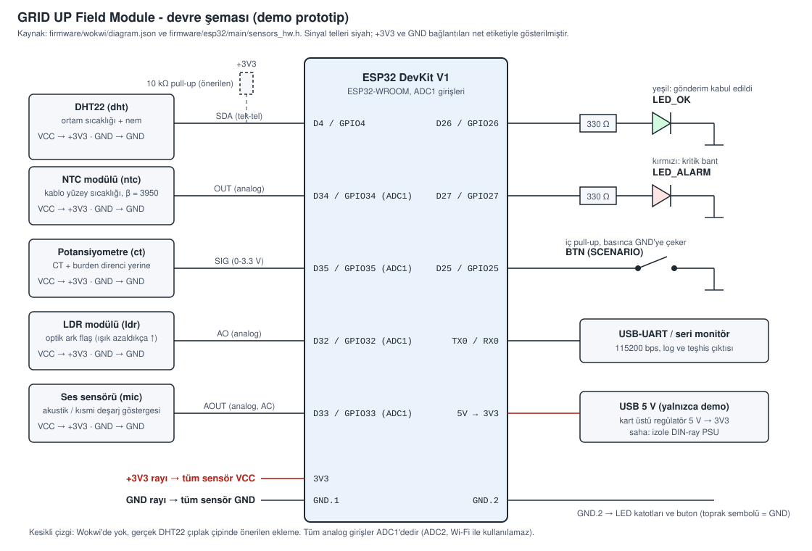

# Elektronik Tasarım Dokümantasyonu — Field Module

Bu doküman hackathon brief'inin Teknik Çıktılar madde 2'sini karşılar: kart
yapısı, giriş-çıkış bağlantıları, bağlantı şeması ve temel bileşenler.
Firmware akışı için bkz. [firmware-flow.md](firmware-flow.md), konsept blok
diyagramı için [hardware-architecture.md](hardware-architecture.md).

> **Kapsam ve dürüst çerçeve.** Aşağıdaki şema, **demo prototipin** şemasıdır:
> ESP32 DevKit + hazır sensör modülleri. Wokwi simülasyonunda çalıştırılmış ve
> pin/bağlantıları `firmware/wokwi/diagram.json` ile eşleştirilmiştir. **Özel
> bir PCB yerleşimi (layout) çizilmemiştir** ve gerçek donanım inşa edilip
> denenmemiştir. Saha (production) sürümü için gereken değişiklikler
> [aşağıda](#sahaya-geçişte-değişecekler) listelenmiştir.

## Devre şeması



Kaynak dosya: [assets/field-module-schematic.svg](assets/field-module-schematic.svg).

## Giriş-çıkış (pin) tablosu

| ESP32 pini | GPIO | Bağlantı | Tür | Firmware kullanımı |
| ---------- | ---- | -------- | --- | ------------------ |
| D4 | GPIO4 | DHT22 `SDA` | Dijital, tek-tel | Ortam sıcaklığı + nem |
| D34 | GPIO34 (ADC1_CH6) | NTC modülü `OUT` | Analog giriş | Kablo sıcaklığı (β = 3950) |
| D35 | GPIO35 (ADC1_CH7) | Potansiyometre `SIG` | Analog giriş | Akım (CT yerine, 0-250 A) |
| D32 | GPIO32 (ADC1_CH4) | LDR modülü `AO` | Analog giriş | Ark flaş (optik yoğunluk, %) |
| D33 | GPIO33 (ADC1_CH5) | Ses sensörü `AOUT` | Analog giriş | Akustik (AC genlik, dB) |
| D26 | GPIO26 | Yeşil LED, 330 Ω üzerinden | Dijital çıkış | STATUS: son gönderim kabul edildi |
| D27 | GPIO27 | Kırmızı LED, 330 Ω üzerinden | Dijital çıkış | ALARM: kritik bant |
| D25 | GPIO25 | Buton → GND | Dijital giriş (iç pull-up) | Demo senaryosu değiştirme |
| TX0 / RX0 | GPIO1 / GPIO3 | USB-UART | UART, 115200 bps | Log ve teşhis |
| 3V3 / GND | — | Tüm sensör `VCC` / `GND` | Güç | — |

**Tasarım gerekçeleri**

- **Tüm analog girişler ADC1'de.** ESP32'de ADC2, Wi-Fi çalışırken kullanılamaz;
  sensörler bu yüzden GPIO32-35'e konmuştur.
- **LED'ler GPIO26/27'de.** GPIO34-39 yalnızca girişlerdir; çıkış için uygun değildir.
- **Modülden panoya çıkış yoktur.** Röle, kesici veya kontrol çıkışı
  tanımlanmamıştır; LED'ler yalnızca yerel göstergedir. Modül sadece izler
  (bkz. [field-module.md](field-module.md)).
- **DHT22 pull-up.** Hazır DHT22 modüllerinde pull-up kart üstündedir; çıplak
  çip kullanılırsa `SDA` ile +3V3 arasına 10 kΩ eklenmelidir (Wokwi'de gerekmez,
  şemada kesikli çizgiyle gösterilmiştir).

## Bileşen listesi (demo prototip)

Model/marka ve fiyat verilmemiştir (bkz. [bom.md](bom.md), tedarikçi teklifi
gerekir).

| Bileşen | Wokwi parçası | Rolü | Saha karşılığı (sınıf) |
| ------- | ------------- | ---- | ---------------------- |
| Mikrodenetleyici kartı | `wokwi-esp32-devkit-v1` | Örnekleme, tamponlama, Wi-Fi/HTTP | Düşük maliyetli Wi-Fi'li MCU modülü (yalnızca çıplak modül, geliştirme kartı değil) |
| Sıcaklık + nem | `wokwi-dht22` | Pano içi ortam | Endüstriyel dereceli dijital sıcaklık/nem sensörü |
| Kablo yüzey sıcaklığı | `wokwi-ntc-temperature-sensor` | Kablo/bara sıcaklığı | İzole temas tipi NTC/PT100 prob |
| Akım | `wokwi-potentiometer` | CT çıkışının simülasyonu | Split-core CT + burden direnci + koşullandırma |
| Ark flaş | `wokwi-photoresistor-sensor` | Optik yoğunluk | Optik ark sensörü (fotodiyot tabanlı) |
| Akustik | `wokwi-small-sound-sensor` | Kısmi deşarj göstergesi | MEMS mikrofon / ultrasonik sensör |
| Durum LED'leri | 2 × `wokwi-led` + 2 × 330 Ω | Yerel gösterge | Panel önü gösterge LED'i |
| Buton | `wokwi-pushbutton-6mm` | Demo modu seçimi | Servis / test butonu |
| Güç | USB 5 V, kart üstü regülatör | Yalnızca demo | İzole DIN-ray güç kaynağı + koruma |

## Kart yapısı (konsept)

Özel PCB henüz yoktur. Saha kartı için öngörülen bölümlendirme:

```
┌───────────────────────────────────────────────────────┐
│  GÜÇ BÖLGESİ            │  MCU BÖLGESİ                │
│  izole PSU girişi,      │  Wi-Fi'li MCU modülü,       │
│  sigorta, TVS, regülatör│  ADC1 girişleri, UART       │
├─────────────────────────┼─────────────────────────────┤
│  ANALOG GİRİŞ BÖLGESİ   │  DİJİTAL / KULLANICI        │
│  sensör konnektörleri,  │  DHT22 hattı, LED'ler,      │
│  koşullandırma/filtre   │  servis butonu              │
└───────────────────────────────────────────────────────┘
Sensör konnektörleri ayrılabilir; hiçbir kanal panonun güç devresine bağlanmaz.
```

Analog giriş bölgesi güç bölgesinden ayrı tutulur ve ayrı GND dönüşü
kullanılır; ADC'nin gürültüye duyarlılığı (özellikle akustik kanal) bunu
gerektirir.

## Sahaya geçişte değişecekler

Demo şemasından production'a geçerken şunlar tasarlanmalı ve saha koşullarında
doğrulanmalıdır. Hiçbiri bu hackathon kapsamında yapılmamıştır.

- **Akım kanalı:** Potansiyometre yerine split-core CT, burden direnci, ADC'yi
  aşırı gerilimden koruyan giriş devresi ve ortalama/RMS koşullandırması.
  Firmware'deki `0-250 A` eşlemesi seçilen CT'ye göre yeniden hesaplanmalıdır.
- **Akustik kanal:** Firmware genlik ölçer (RMS) ve boştaki gürültü tabanı
  Wokwi'ye göre ayarlanmıştır (`ACOUSTIC_IDLE_RMS`). Gerçek mikrofon ve
  kabin ortamıyla yeniden kalibre edilmelidir; bu kanal kısmi deşarj **göstergesi**dir,
  gerçek PD ölçümü (UHF/TEV/HFCT) değildir.
- **Ark flaş kanalı:** Wokwi'deki LDR modülünün davranışı (ışık azaldıkça artan
  çıkış) modele özgüdür; gerçek optik sensörün polaritesi ve eşikleri sahada
  ölçülmelidir.
- **Saha koşulları:** Sıcaklık aralığı, manyetik alan/EMI önlemleri ve çevre
  etkileri için bkz. [field-conditions.md](field-conditions.md); kurulum ve arıza
  modları için [installation-and-failure-analysis.md](installation-and-failure-analysis.md).
- **Güç ve izolasyon:** USB yerine izole DIN-ray güç kaynağı, sigorta,
  aşırı gerilim koruması, EMC/EMI filtreleme (bkz.
  [field-installation.md](field-installation.md)).
- **Mekanik:** Endüstriyel kutu, ayrılabilir endüstriyel konnektörler, kabin
  içi montaj.

## Doğrulama durumu

| Madde | Durum |
| ----- | ----- |
| Şema ↔ `diagram.json` pin eşleşmesi | Elle kontrol edildi (GPIO4, 25, 26, 27, 32-35) |
| Wokwi simülasyonu | Çalıştırıldı: sensör okuma, provizyon, API'ye gönderim |
| Gerçek donanımda çalışma | Denenmedi |
| PCB yerleşimi (layout) | Yapılmadı |
| EMC / izolasyon / güvenlik testi | Yapılmadı |

## İlgili dosyalar

| Dosya | İçerik |
| ----- | ------ |
| [firmware-flow.md](firmware-flow.md) | Firmware akış diyagramı |
| [hardware-architecture.md](hardware-architecture.md) | Blok diyagram (konsept) |
| [field-module.md](field-module.md) | Modül konsepti ve sensör yaklaşımı |
| [field-conditions.md](field-conditions.md) | Sıcaklık, manyetik alan ve çevre etkileri |
| [installation-and-failure-analysis.md](installation-and-failure-analysis.md) | Kurulum yaklaşımı ve arıza modları analizi |
| [bom.md](bom.md) | Kavramsal malzeme listesi |
| [field-installation.md](field-installation.md) | Kurulum ve güç prensipleri |
| [../firmware/wokwi/README.md](../firmware/wokwi/README.md) | Wokwi diagram'ı ve ADC dönüşümleri |
