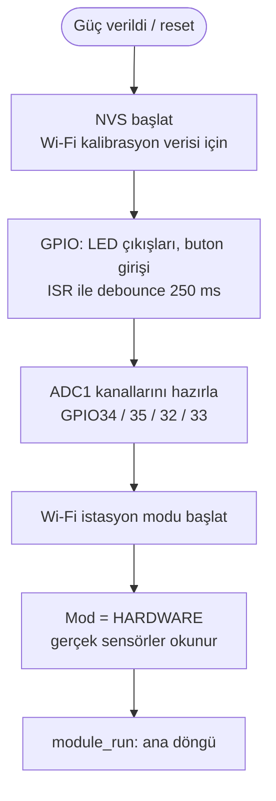
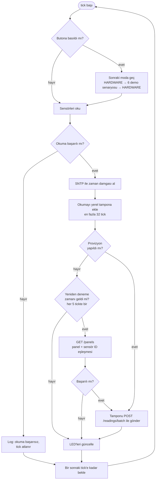
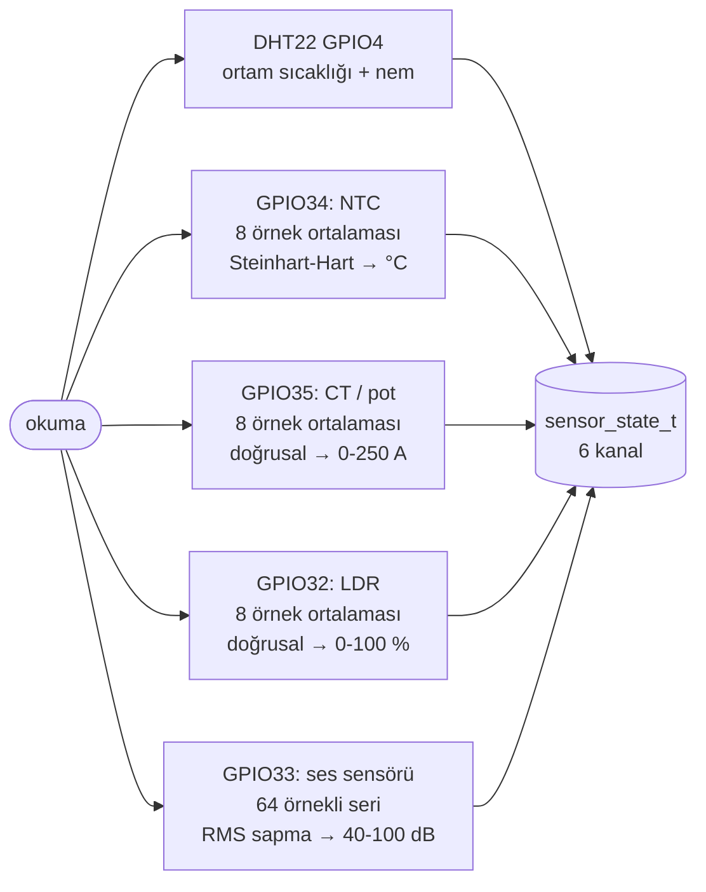
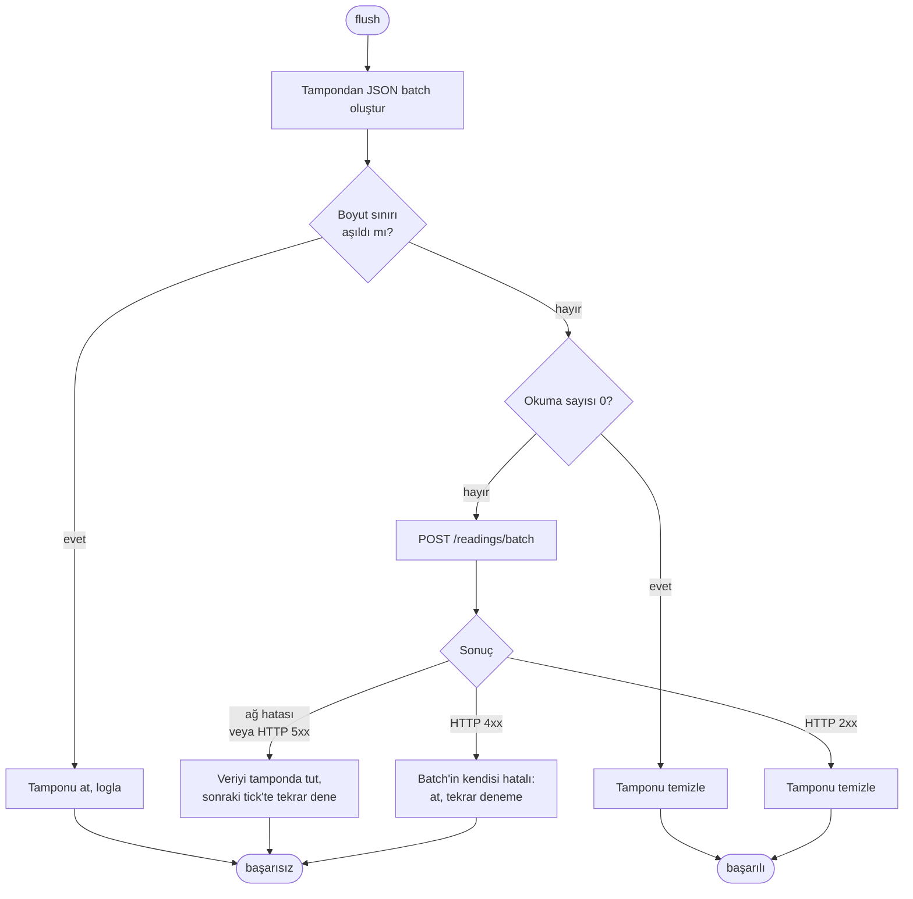

# Firmware Akış Diyagramı — Field Module (ESP32)

Bu doküman, `firmware/` altındaki C kodunun çalışma mantığını gösterir
(hackathon brief'i, Teknik Çıktılar madde 3). Diyagramlar koddan çıkarılmıştır:
`firmware/esp32/main/main.c`, `firmware/core/module.c`,
`firmware/esp32/main/sensors_hw.c`, `firmware/core/provision.c`.

Kod iki katmana ayrılmıştır: **platforma bağımsız çekirdek** (`firmware/core`,
PC'de sahte HAL ile birim testli) ve **ESP32 katmanı** (`firmware/esp32`:
Wi-Fi, HTTP, SNTP, DHT22, ADC, GPIO).

## 1. Açılış (`app_main`)

## 2. Ana döngü (her tick, varsayılan aralık `CONFIG_GRIDUP_SAMPLE_INTERVAL_MS`)

**LED mantığı** (`on_tick` in `main.c`):

| LED | Pin | Yanma koşulu |
| --- | --- | ------------ |
| Yeşil (STATUS) | GPIO26 | Son gönderim sunucu tarafından kabul edildi |
| Kırmızı (ALARM) | GPIO27 | Herhangi bir kanal kritik banda girdi (`sensors_in_critical_band`): kablo ≥ 75 °C, nem ≥ %80, akım ≥ 150 A, ark flaş ≥ %30, akustik ≥ 70 dB. Ortam sıcaklığı hariç |

## 3. Sensör okuma (`sensors_hw_read`, HARDWARE modu)

Okunamayan kanal `NaN` olur; `NaN` kanallar payload'a yazılmaz ve kritik-bant
değerlendirmesinde yok sayılır. DHT22 hatası tüm turu iptal etmez, yalnızca o
iki kanal `NaN` kalır.

## 4. Gönderim ve hata yönetimi (`flush`)

**Tasarım kararları:**

- **Sunucu yokken de çalışır.** Modül açılışta API'yi bulamazsa örneklemeye ve
  tamponlamaya devam eder; bağlanınca birikeni tek batch'te yollar. Tampon
  ESP32 derlemesinde 32 tick'tir (`BUFFER_CAPACITY`); dolunca en eski kayıt
  düşer ve sayaçta tutulur (sınırlı bellek).
- **Yeniden deneme seyrek.** Provizyon denemesi HTTP zaman aşımı kadar
  bloklayabildiği için her 5 tickte bir yapılır; ölü bir sunucu örneklemeyi
  durdurmaz.
- **4xx yeniden denenmez.** Hatalı bir batch sonsuza kadar tekrar gönderilmez.
- **Yalnızca sensörden merkeze.** Modülde röle/kesici gibi bir çıkış yoktur
  (bkz. [field-module.md](field-module.md)); LED'ler yalnızca yerel göstergedir.

## 5. Demo modları (butona basınca)

Buton (GPIO25) modu sırayla değiştirir: `HARDWARE` (gerçek sensörler) →
`NORMAL` → `OVERHEATING` → `OVERCURRENT` → `HIGH_HUMIDITY` → `ARC_FLASH` →
`COMBINED_FAILURE` → tekrar `HARDWARE`. Demo modlarında değerler sentetik
kaynaktan gelir ve mod değişimi seri konsola `[mode] DEMO: ... (not real sensor
data)` olarak yazılır; sentetik veri gerçek ölçüm gibi sunulmaz.

## Doğrulama durumu

Çekirdek mantık (provizyon, tampon, 4xx/5xx, sunucu yokken açılış, başarısız
okuma) sahte HAL ile birim testlidir (`make test` in `firmware/`). Aynı akış
Wokwi simülasyonunda çalıştırılmıştır (bkz.
[../firmware/wokwi/README.md](../firmware/wokwi/README.md)). Gerçek kartta ve
gerçek sensörlerle denenmemiştir.

## İlgili dosyalar

| Dosya | İçerik |
| ----- | ------ |
| [electronic-design.md](electronic-design.md) | Devre şeması, pin ve bileşen tablosu |
| [hardware-architecture.md](hardware-architecture.md) | Blok diyagram (konsept) |
| [field-data-contract.md](field-data-contract.md) | Modülün gönderdiği payload biçimi |
